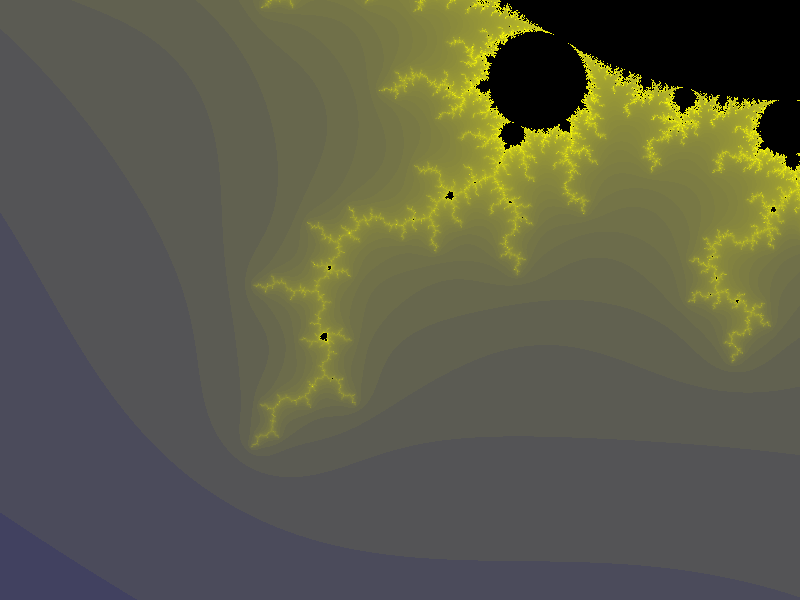
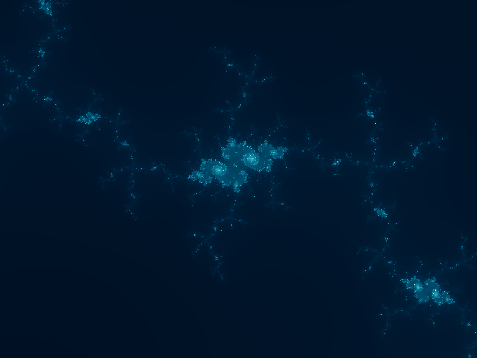
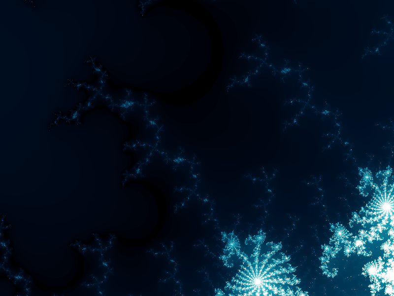
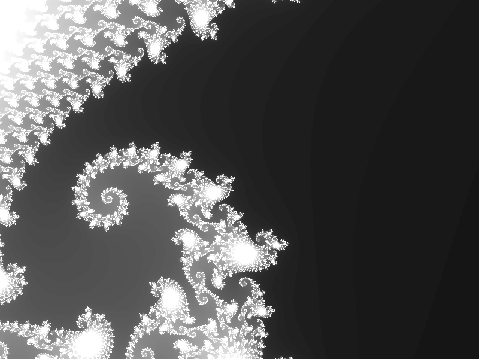

# glFractal
a simple fractal drawing program based on OpenGL

## Dependency

- [GLFW3](http://www.glfw.org/download.html)
- [GLEW](http://glew.sourceforge.net/) 
- [svpng](https://github.com/miloyip/svpng/blob/master/svpng.inc) 

## Usage

```
$ git clone git@github.com:DingShizhe/glFractal.git
$ cd glFractal
$ make
$ ./fractal
```

## Render Example

 
 
